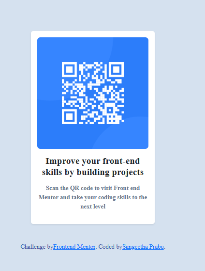

# Frontend Mentor - QR code component

## Welcome! 👋

This Project has the QR code challenges with Bootstrap.

1. Used Bootstrap’s utility classes to replace custom styling for padding, margins, and alignment.
2. Used Bootstrap’s card component to simplify the layout.
3. Applied Bootstrap’s grid system to center the component on the page.
